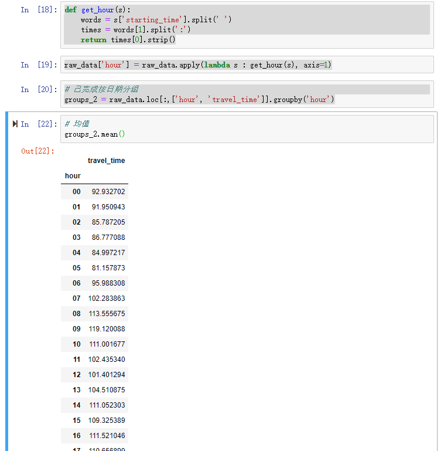

# 数据挖掘任务 第一阶段

姓名：王永锋

学号：16337237

小组：智能分布式系统

[TOC]

## 相关环境的安装

该部分需要安装以下几个环境：numpy、matplotlib、scipy、
pandas、sklearn、xgboost、keras、gensim。

我在自己的电脑上安装了anaconda，然后上面的这一些包其实都可以通过conda包管理器进行安装。

关于这些代入这些环境并使用的结果，可见"source/env.ipynb"，我已经在我电脑上配置好了所有环境，并且可使用。


## 数据分析及可视化

关于该部分完整代码及运行结果，可见"source/task1.ipynb"

### （1）

该部分要求统计不同路段内 travel_time的均值、标准差、最大值、最小值、中位数。代码如下，

```
groups_1 = raw_data.loc[:,['intersection_id', 'travel_time']].groupby('intersection_id')
# 均值
groups_1.mean()
# 标准差
groups_1.std()
# 最大值
groups_1.max()
# 最小值
groups_1.min()
# 中位数
groups_1.median()
```

运行结果可见


### （2）

一天按照24小时，统计不同小时内travel_time的均值、标准差、最大值、最小值、中位数。

代码如下
```
def get_hour(s):
    words = s['starting_time'].split(' ')
    times = words[1].split(':')
    return times[0].strip()
raw_data['hour'] = raw_data.apply(lambda s : get_hour(s), axis=1)
# 已完成按日期分组
groups_2 = raw_data.loc[:,['hour', 'travel_time']].groupby('hour')
# 均值
groups_2.mean()
# 标准差
groups_2.std()
# 最大值
groups_2.max()
# 最小值
groups_2.min()
# 中位数
groups_2.median()
```

运行截图可见



### （3）

统计不同路段不同小时内travel_time的均值、标准差、最大值、最小值、中位数。

代码如下

```
groups_3 = raw_data.loc[:,['intersection_id','hour', 'travel_time']].groupby(['intersection_id', 'hour'])
# 均值
groups_3.mean()
# 标准差
groups_3.std().head()
# 最大值
groups_3.max().head()
# 最小值
groups_3.min().head()
# 中位数
groups_3.median().head()
```

运行结果可见


### （4）

可视化一天内，按照每小时统计的车流量、通行时间图

车流量在一天内的分布可见下图


通行时间在一天内的分布可见下图


### 总结数据特点

1. 本份数据说明了，三个路口上每一辆车的进入时间与通行时间
2. 在车流量上，从图1中可以很明显地看出，在从早晨5点开始车流量渐渐变大，在约8点时达到顶峰，8点至13点之间会有一个低谷，在13点左右车流量又会达到一个顶峰，此后随着时间推移，越晚车流量越少
3. 在每一辆车的通行时间上，从图2中可以看出，在早上8~9点时每一辆车的平均通行时间达到一天顶峰，通行时间在一天内的不均匀，这说明了那一条路当时很可能很容易堵车，并且通行时间很容易受到车流量的影响