# 数据挖掘任务 第二阶段

姓名：王永锋

学号：16337237

小组：智能分布式系统

[TOC]

这一个阶段，我主要完成了kaggle上的Titanic: Machine Learning from Disaster。

## 基础特征及其交叉验证结果

在开始完成这个任务前，我先对原始数据做了简单的特征提取，一些较复杂的特征没有处理直接丢弃。

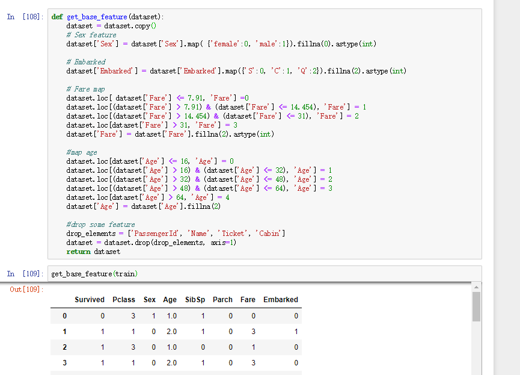

在这样的基础特征下，我使用了sklearn的多种分类器进行尝试，按照cross validataion-3folds要求进行计算分类结果的AUC结果，结果可见：

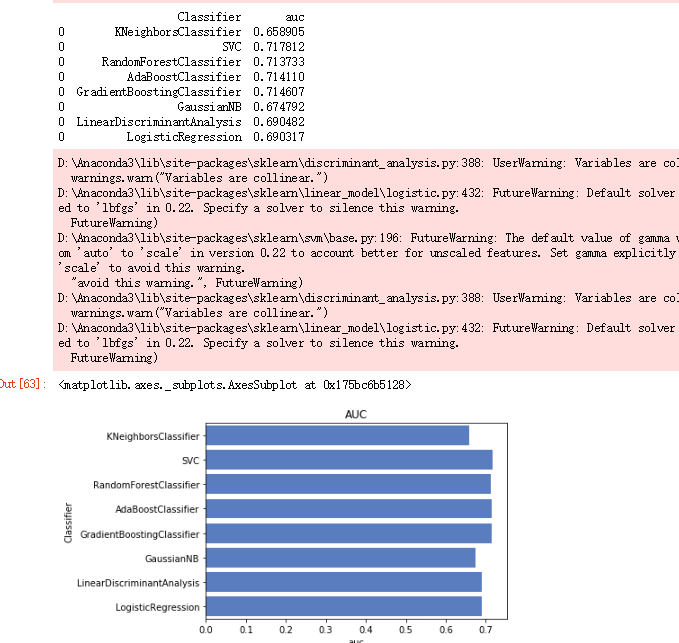

可以看到，此时的AUC分数还在0.70左右，仍然较低。

## 特征工程

在这一个部分，我提取了两个特征，并抛弃了原来的一些特征。

### 增加孤独特征

在前期数据分析的时候便发现，孤独的人相对而言获救概率更低。

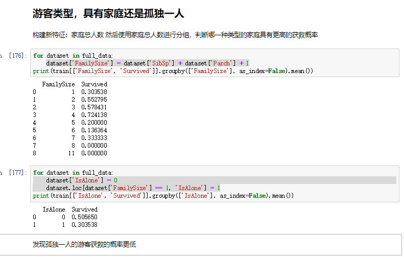

因此，我编写了以下代码提取孤独特征`IsAlone`，并删去了生成该特征的`SibSp`和`Parch`。

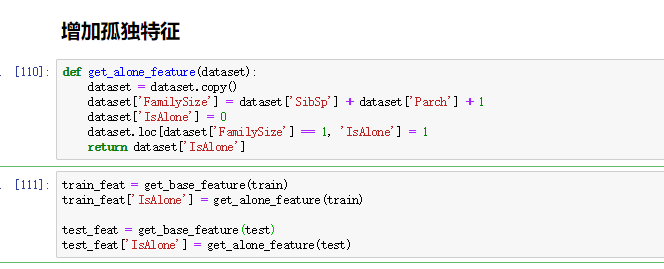

效果是很明显的，平均的AUC分数上升到0.83-0.84左右。

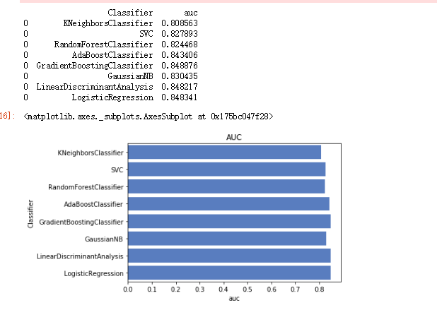

### 增加名字特征

名字中不同的称呼，可能也能够反映不同的人社会地位的不同，这对获救概率也会有一定的影响。

因此我编写了以下的代码给原数据集增加称呼特征

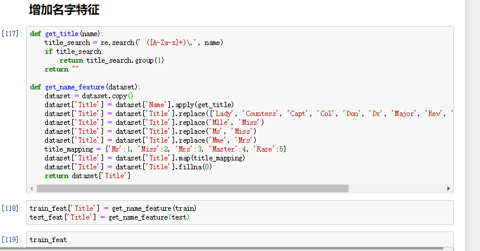

该特征对于模型效果的特征也是有一定效果的，AUC分数从0.83~0.84上升到0.84~0.85左右。

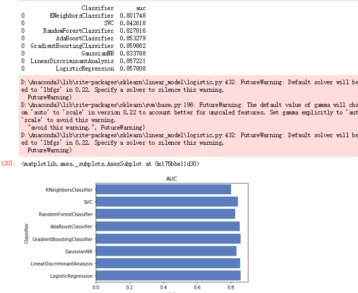

## 输出特征的重要性程度

重要性程度可见下图

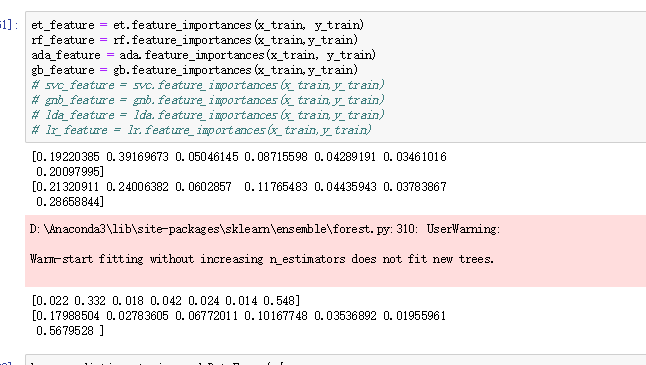

部分结果的可视化可见下图
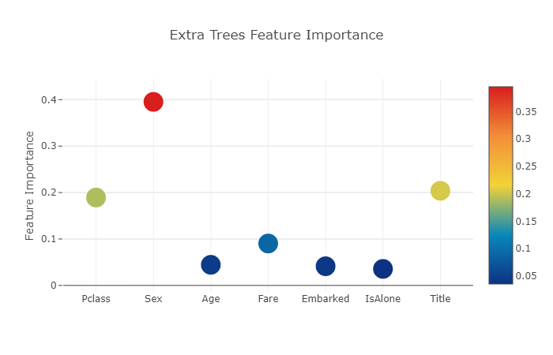

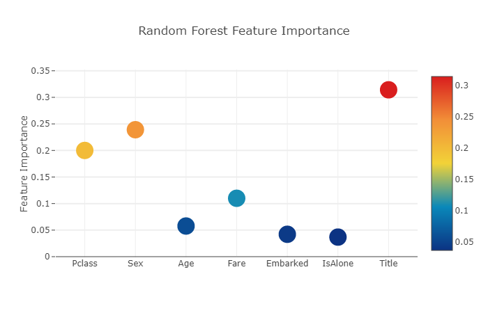

## 模型融合

这部分我在第一层使用了这些模型作为基模型。

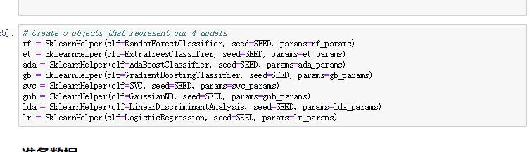

这些模型输出的线性相关程度如下图

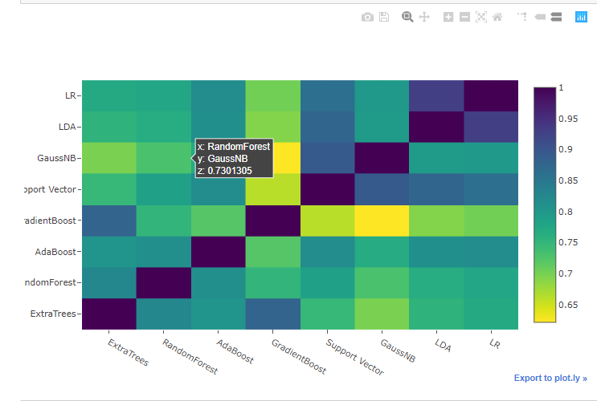

然后将上面的模型的输出作为输入，使用xgboost模型得到第二层模型的输出。

进行了交叉验证，可以见到这一个二层的容和模型能够将AUC分数稳定在0.85左右。

但是提升效果并不大，我想可能与之前有些模型的输出结果线性相关程度过高有关。

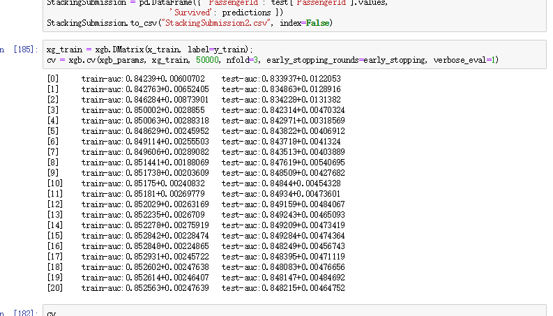

## 最终结果

在kaggle上提交了多次结果，可以见到这一个二层的融合模型能够将AUC分数稳定在0.85 左右

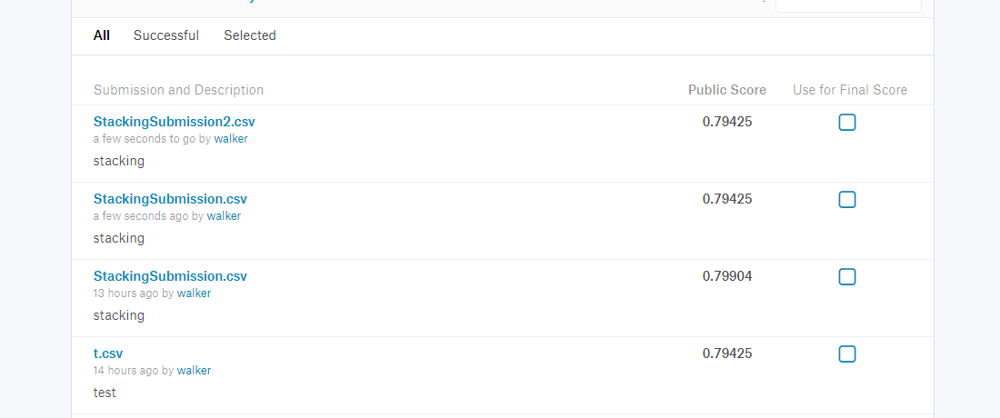

其中，的确发现，在模型融合中，模型的选择也是很重要的一部分，要选择输出的相关程度较低的，可能能够获得更好的效果。